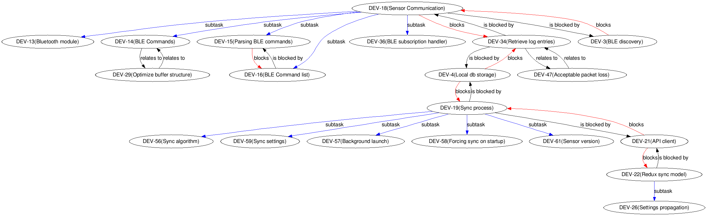
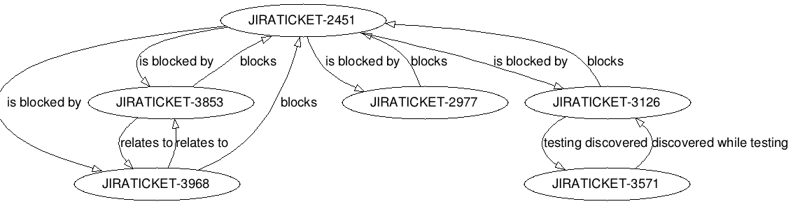

jira-dependency-graph
=====================

Graph visualizer for dependencies between JIRA tickets. Takes into account subtasks and issue links.

Uses JIRA rest API v2 for fetching information on issues.
Uses [Google Chart API](https://developers.google.com/chart/) for graphical presentation.

Example output
==============



Requirements:
=============
* Python 2.7+ or Python 3+
* [requests](http://docs.python-requests.org/en/master/)

Or
* [docker](https://docs.docker.com/install/)

Usage:
======
```bash
$ git clone https://github.com/pawelrychlik/jira-dependency-graph.git
$ virtualenv .virtualenv && source .virtualenv/bin/activate # OPTIONAL
$ cd jira-dependency-graph
$ pip install -r requirements.txt
$ python jira-dependency-graph.py --user=your-jira-username --password=your-jira-password --jira=url-of-your-jira-site issue-key
```

Or if you prefer running in docker:
```bash
$ git clone https://github.com/pawelrychlik/jira-dependency-graph.git
$ cd jira-dependency-graph
$ docker build -t jira .
$ docker run -v $PWD/out:/out jira python jira-dependency-graph.py --user=your-jira-username --password=your-jira-password --jira=url-of-your-jira-site --file=/out/output.png issue-key
```

```
# e.g.:
$ python jira-dependency-graph.py --user=pawelrychlik --password=s3cr3t --jira=https://your-company.jira.com JIRATICKET-718

Fetching JIRATICKET-2451
JIRATICKET-2451 <= is blocked by <= JIRATICKET-3853
JIRATICKET-2451 <= is blocked by <= JIRATICKET-3968
JIRATICKET-2451 <= is blocked by <= JIRATICKET-3126
JIRATICKET-2451 <= is blocked by <= JIRATICKET-2977
Fetching JIRATICKET-3853
JIRATICKET-3853 => blocks => JIRATICKET-2451
JIRATICKET-3853 <= relates to <= JIRATICKET-3968
Fetching JIRATICKET-3968
JIRATICKET-3968 => blocks => JIRATICKET-2451
JIRATICKET-3968 => relates to => JIRATICKET-3853
Fetching JIRATICKET-3126
JIRATICKET-3126 => blocks => JIRATICKET-2451
JIRATICKET-3126 => testing discovered => JIRATICKET-3571
Fetching JIRATICKET-3571
JIRATICKET-3571 <= discovered while testing <= JIRATICKET-3126
Fetching JIRATICKET-2977
JIRATICKET-2977 => blocks => JIRATICKET-2451

Writing to issue_graph.png
```
Result:



Advanced Usage:
===============

List of all configuration options with descriptions:

```
python jira-dependency-graph.py --help
```

### Excluding Links

In case you have specific issue links you don't want to see in your graph, you can exclude them:

```bash
$ python jira-dependency-graph.py --user=your-jira-username --password=your-jira-password --jira=url-of-your-jira-site --exclude-link 'is required by' --exclude-link 'duplicates' issue-key
```

The grapher will still walk the link, just exclude the edge. This especially useful for bidirectional links and you only
want to see one of them, e.g. *depends on* and *is required by*.

### Excluding Epics

In case you want to exclude walking into issues of an Epic, you can ignore them:

```bash
$ python jira-dependency-graph.py --user=your-jira-username --password=your-jira-password --jira=url-of-your-jira-site --ignore-epic issue-key
```

### Including Issues

In order to only specify issues with a certain prefix pass in `--issue-include <XXX>` and all tickets will be checked that they match the prefix `XXX`.

### Excluding Issues

By passing in `--issue-exclude`, or `-xi` the system will explicitly ignore the ticket. It can be repeated multiple times, e.g. `-xi MYPR-456 -x MYPR-999` to ignore both issues. 
Use it as a last-resort only, when other means of exclusion do not suit your case, e.g. to omit a part of the graph for better readability.

### Authentication

It is possible to either use the username/password combination or to login via the browser passing in `--cookie <JSESSIONID>`. This logins via the browser and is useful in scenarios where Kerberos authentication is required.

### Closed Issues

By passing in `--ignore-closed` the system will ignore any ticket that is closed.

### Multiple Issues

Multiple issue-keys can be passed in via space separated format e.g.
```bash
$ python jira-dependency-graph.py --cookie <JSESSIONID> issue-key1 issue-key2
```


Usage without Google Graphviz API:
============
If you have issues with the Google Graphviz API limitations you can use your local graphviz installation like this:

```bash
$ git clone https://github.com/pawelrychlik/jira-dependency-graph.git
$ cd jira-dependency-graph
$ python jira-dependency-graph.py --user=your-jira-username --password=your-jira-password --jira=url-of-your-jira-site --local issue-key | dot -Tpng > issue_graph.png
```

*Note*: Its possible that the graph produced is too wide if you have a number of issues. In this case, it is better to firstly pipe the graph to a 'dot' text file e.g.

```bash
$ python jira-dependency-graph.py --jira=url-of-your-jira-site --local issue-key > graph.dot
```

and then process it using `unflatten`:

```bash
unflatten -f -l 4 -c 16 graph.dot  | dot | gvpack -array_t6 | neato -s -n2 -Tpng -o graph.png
```

For a slightly cleaner layout (that preserves the ranks), or if your system doesn't have `unflatten`, you can use `sed` to insert `rankdir=LR;` into the dot file before processing it:
```bash
sed -i 's/digraph{/digraph{ rankdir=LR;/g' graph.dot | dot -o graph.png -Tpng
```

Notes:
======
Based on: [draw-chart.py](https://developer.atlassian.com/download/attachments/4227078/draw-chart.py) and [Atlassian JIRA development documentation](https://developer.atlassian.com/display/JIRADEV/JIRA+REST+API+Version+2+Tutorial#JIRARESTAPIVersion2Tutorial-Example#1:GraphingImageLinks), which seemingly was no longer compatible with JIRA REST API Version 2.
